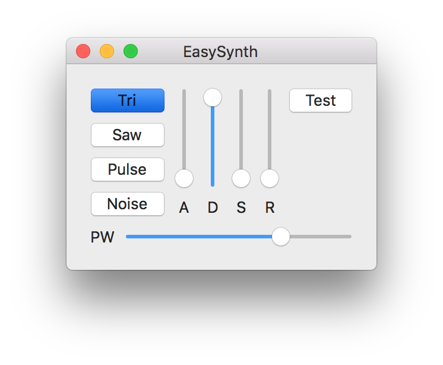

EasySynth
=========

EasySynth is an application to turn a Commodore 64 equipped with an
[EasyFlash 3](http://skoe.de/easyflash/doku.php?id=ef3intro) cartridge
in a MIDI synthesizer.

Hardware requirements
---------------------

* A computer running OS X
* A Commodore 64
* An EasyFlash 3 cartridge

Principle of operation
----------------------

A small program, `C64/c64.prg`, should be loaded in a Commodore 64
equipped with an EasyFlash cartridge. This will communicate thru
the EasyFlash's USB interface with the OSX EasySynth application.

EasySynth on OSX will create a virtual MIDI port, visible from other
MIDI applications like Ableton Live or Apple Logic Pro.

